# Architecture Design

This document describes the high-level architecture of **Agent Spaces**, an open-source framework for creating and managing isolated code execution environments for AI agents.

## Table of Contents

1. [System Overview](#system-overview)
2. [High-Level Architecture](#high-level-architecture)
3. [Core Components](#core-components)
4. [Data Flow](#data-flow)
5. [Deployment Models](#deployment-models)
6. [Security Architecture](#security-architecture)

---

## System Overview

Agent Spaces provides isolated execution environments where AI agents can safely create files and run code. The system follows a client-server architecture where:

- **Clients** (AI agents, developers) interact via REST API or TypeScript SDK
- **Server** manages spaces, executes operations, enforces policies, and returns events
- **Spaces** are isolated containers with their own filesystem, runtime, and policies

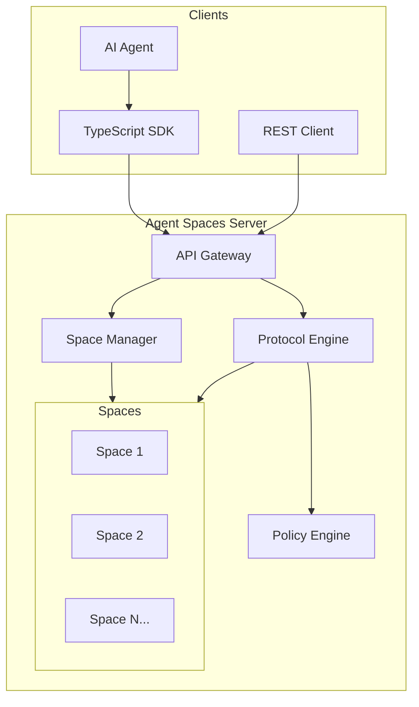
```mermaid
flowchart TB
    subgraph Clients
        AI[AI Agent]
        SDK[TypeScript SDK]
        REST[REST Client]
    end
    
    subgraph "Agent Spaces Server"
        API[API Gateway]
        SM[Space Manager]
        PE[Protocol Engine]
        POL[Policy Engine]
        
        subgraph Spaces
            S1[Space 1]
            S2[Space 2]
            S3[Space N...]
        end
    end
    
    AI --> SDK
    SDK --> API
    REST --> API
    API --> SM
    API --> PE
    PE --> POL
    SM --> Spaces
    PE --> Spaces
```

---

## High-Level Architecture

### Layered Architecture

The system is organized in four layers:

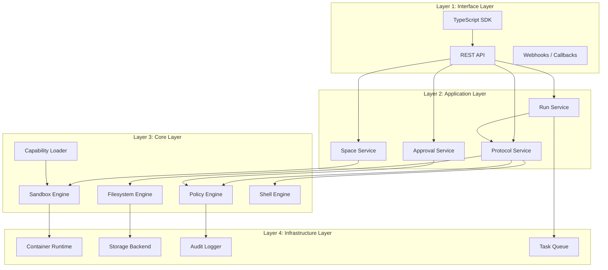
```mermaid
flowchart TB
    subgraph "Layer 1: Interface Layer"
        REST_API[REST API]
        TS_SDK[TypeScript SDK]
        WEBHOOK[Webhooks / Callbacks]
    end
    
    subgraph "Layer 2: Application Layer"
        SPACE_SVC[Space Service]
        RUN_SVC[Run Service]
        PROTOCOL_SVC[Protocol Service]
        APPROVAL_SVC[Approval Service]
    end
    
    subgraph "Layer 3: Core Layer"
        POLICY_ENGINE[Policy Engine]
        SANDBOX_ENGINE[Sandbox Engine]
        FS_ENGINE[Filesystem Engine]
        SHELL_ENGINE[Shell Engine]
        CAPABILITY_LOADER[Capability Loader]
    end
    
    subgraph "Layer 4: Infrastructure Layer"
        CONTAINER_RT[Container Runtime]
        STORAGE[Storage Backend]
        AUDIT_LOG[Audit Logger]
        QUEUE[Task Queue]
    end
    
    REST_API --> SPACE_SVC
    TS_SDK --> REST_API
    REST_API --> RUN_SVC
    REST_API --> PROTOCOL_SVC
    REST_API --> APPROVAL_SVC
    
    SPACE_SVC --> SANDBOX_ENGINE
    RUN_SVC --> PROTOCOL_SVC
    PROTOCOL_SVC --> POLICY_ENGINE
    PROTOCOL_SVC --> FS_ENGINE
    PROTOCOL_SVC --> SHELL_ENGINE
    APPROVAL_SVC --> POLICY_ENGINE
    
    SANDBOX_ENGINE --> CONTAINER_RT
    FS_ENGINE --> STORAGE
    POLICY_ENGINE --> AUDIT_LOG
    RUN_SVC --> QUEUE
    CAPABILITY_LOADER --> SANDBOX_ENGINE
```

### Layer Descriptions

| Layer | Purpose | Components |
|-------|---------|------------|
| **Interface** | External communication | REST API, SDK, Webhooks |
| **Application** | Business logic orchestration | Space, Run, Protocol, Approval services |
| **Core** | Execution primitives | Policy, Sandbox, Filesystem, Shell engines |
| **Infrastructure** | System resources | Containers, Storage, Logging, Queues |

---

## Core Components

### 1. API Gateway

The entry point for all client requests. Handles:

- Authentication and authorization
- Request validation and rate limiting
- Routing to appropriate services
- Response serialization

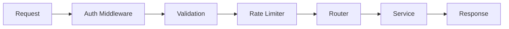
```mermaid
flowchart LR
    REQ[Request] --> AUTH[Auth Middleware]
    AUTH --> VALID[Validation]
    VALID --> RATE[Rate Limiter]
    RATE --> ROUTER[Router]
    ROUTER --> SVC[Service]
    SVC --> RESP[Response]
```

### 2. Space Manager

Manages the lifecycle of execution spaces:

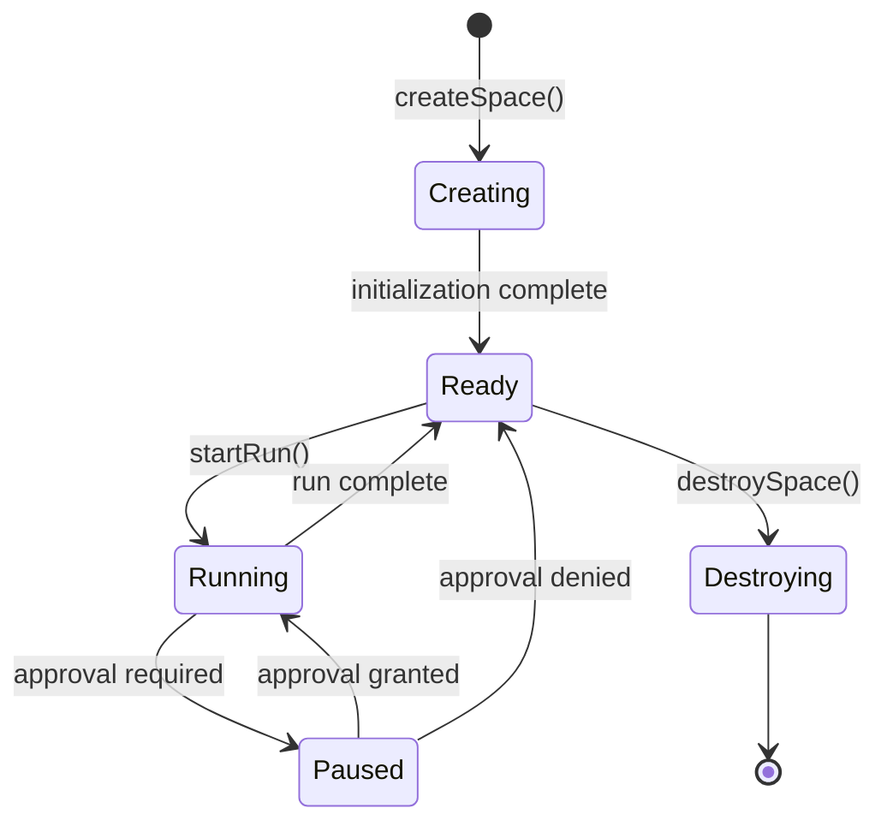
```mermaid
stateDiagram-v2
    [*] --> Creating: createSpace()
    Creating --> Ready: initialization complete
    Ready --> Running: startRun()
    Running --> Ready: run complete
    Running --> Paused: approval required
    Paused --> Running: approval granted
    Paused --> Ready: approval denied
    Ready --> Destroying: destroySpace()
    Destroying --> [*]
```

**Responsibilities:**
- Create/destroy spaces with configured policies
- Initialize workspace filesystems
- Track space metadata and state
- Handle space quotas and limits

### 3. Protocol Engine

Processes the operations/events protocol:

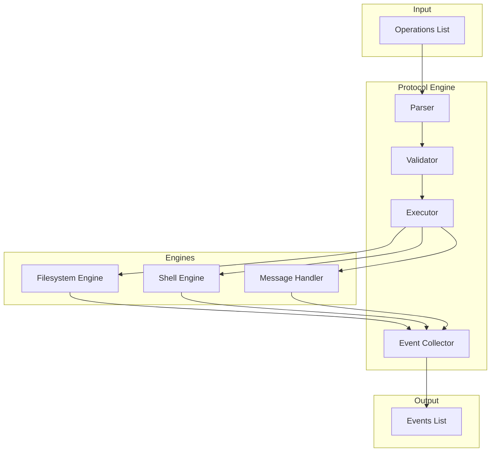
```mermaid
flowchart TB
    subgraph Input
        OPS[Operations List]
    end
    
    subgraph "Protocol Engine"
        PARSE[Parser]
        VALIDATE[Validator]
        EXEC[Executor]
        COLLECT[Event Collector]
    end
    
    subgraph Engines
        FS[Filesystem Engine]
        SH[Shell Engine]
        MSG[Message Handler]
    end
    
    subgraph Output
        EVENTS[Events List]
    end
    
    OPS --> PARSE
    PARSE --> VALIDATE
    VALIDATE --> EXEC
    EXEC --> FS
    EXEC --> SH
    EXEC --> MSG
    FS --> COLLECT
    SH --> COLLECT
    MSG --> COLLECT
    COLLECT --> EVENTS
```

**Responsibilities:**
- Parse and validate operation lists
- Route operations to appropriate engines
- Collect results into event lists
- Handle operation sequencing and dependencies

### 4. Policy Engine

Enforces security policies on all operations:

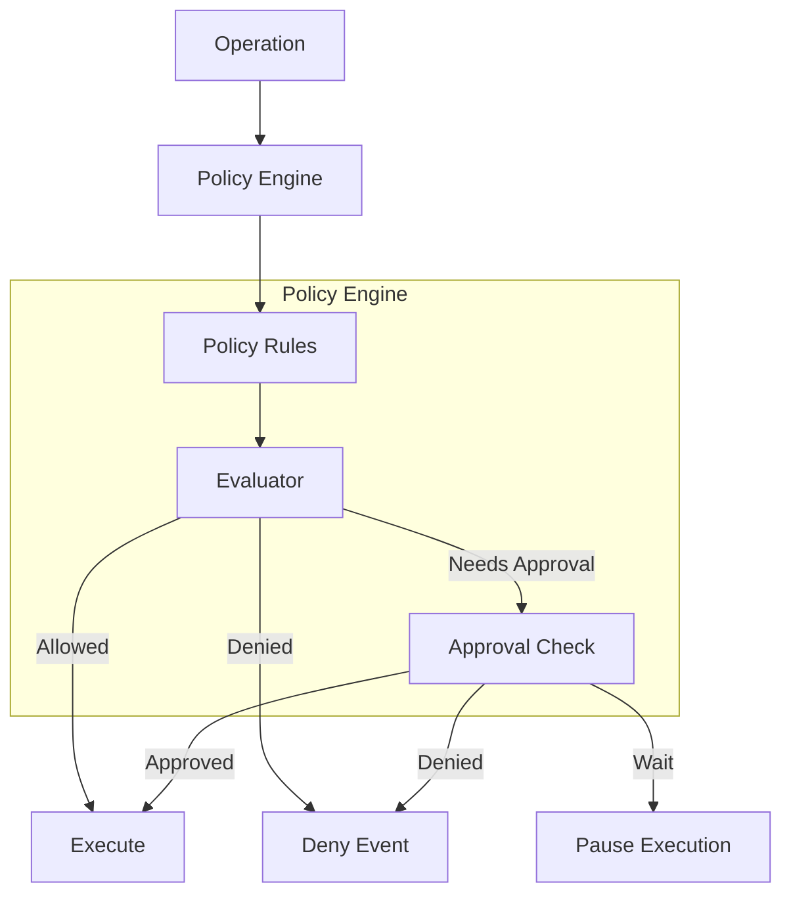
```mermaid
flowchart TB
    OP[Operation] --> POLICY[Policy Engine]
    
    subgraph "Policy Engine"
        RULES[Policy Rules]
        EVAL[Evaluator]
        APPROVAL[Approval Check]
    end
    
    POLICY --> RULES
    RULES --> EVAL
    EVAL -->|Allowed| EXEC[Execute]
    EVAL -->|Denied| DENY[Deny Event]
    EVAL -->|Needs Approval| APPROVAL
    APPROVAL -->|Wait| PAUSE[Pause Execution]
    APPROVAL -->|Approved| EXEC
    APPROVAL -->|Denied| DENY
```

**Policy Types:**
- **Filesystem policies**: Allowed paths, read/write permissions, file size limits
- **Shell policies**: Allowed commands, blocked patterns, execution timeouts
- **Network policies**: Allowed domains, blocked IPs, egress rules
- **Capability policies**: Which SDKs/APIs are available in the space

### 5. Sandbox Engine

Creates and manages isolated execution environments:

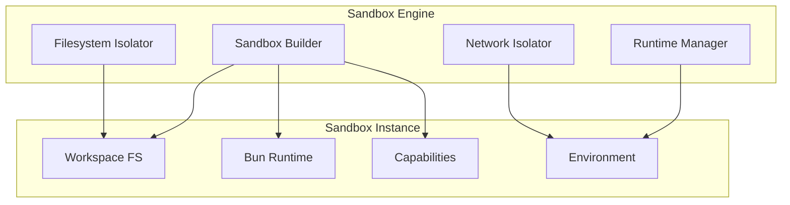
```mermaid
flowchart TB
    subgraph "Sandbox Engine"
        BUILDER[Sandbox Builder]
        RUNTIME[Runtime Manager]
        NETWORK[Network Isolator]
        FS_ISO[Filesystem Isolator]
    end
    
    subgraph "Sandbox Instance"
        WS[Workspace FS]
        BUN[Bun Runtime]
        CAPS[Capabilities]
        ENV[Environment]
    end
    
    BUILDER --> WS
    BUILDER --> BUN
    BUILDER --> CAPS
    RUNTIME --> ENV
    NETWORK --> ENV
    FS_ISO --> WS
```

**Isolation Mechanisms:**
- Process isolation (containers or process sandboxing)
- Filesystem isolation (chroot or overlay filesystems)
- Network isolation (network namespaces or proxies)
- Resource limits (CPU, memory, disk, time)

### 6. Filesystem Engine

Manages file operations within workspaces:

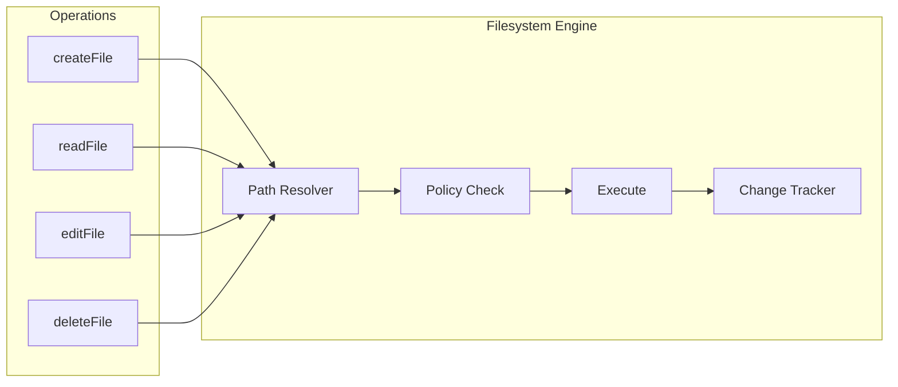
```mermaid
flowchart LR
    subgraph Operations
        CREATE[createFile]
        READ[readFile]
        EDIT[editFile]
        DELETE[deleteFile]
    end
    
    subgraph "Filesystem Engine"
        RESOLVE[Path Resolver]
        POLICY_CHECK[Policy Check]
        EXEC[Execute]
        TRACK[Change Tracker]
    end
    
    CREATE --> RESOLVE
    READ --> RESOLVE
    EDIT --> RESOLVE
    DELETE --> RESOLVE
    
    RESOLVE --> POLICY_CHECK
    POLICY_CHECK --> EXEC
    EXEC --> TRACK
```

### 7. Shell Engine

Executes commands within the sandbox:

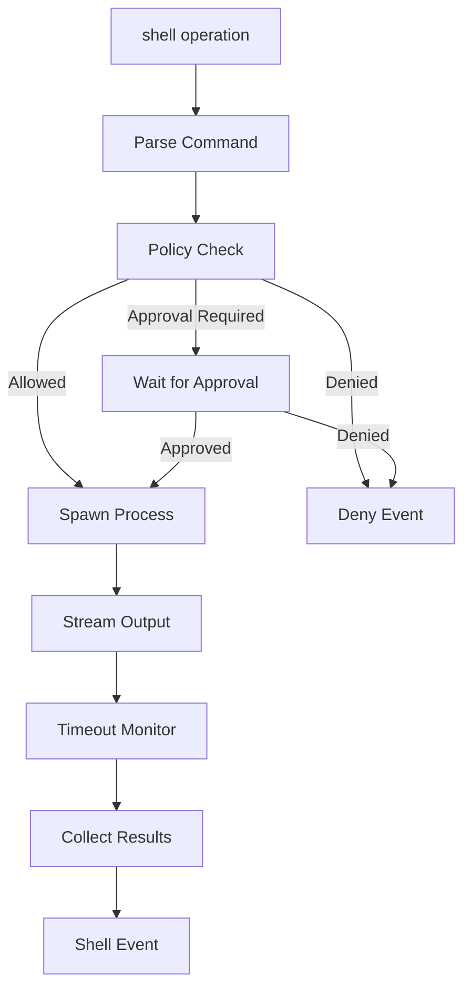
```mermaid
flowchart TB
    CMD[shell operation] --> PARSE[Parse Command]
    PARSE --> POLICY[Policy Check]
    POLICY -->|Allowed| SPAWN[Spawn Process]
    POLICY -->|Denied| DENY[Deny Event]
    POLICY -->|Approval Required| WAIT[Wait for Approval]
    
    SPAWN --> STREAM[Stream Output]
    STREAM --> TIMEOUT[Timeout Monitor]
    TIMEOUT --> COLLECT[Collect Results]
    COLLECT --> EVENT[Shell Event]
    
    WAIT -->|Approved| SPAWN
    WAIT -->|Denied| DENY
```

**Features:**
- Command parsing and sanitization
- Environment variable injection
- Timeout and resource limit enforcement
- Streaming stdout/stderr capture
- Exit code collection

### 8. Capability Loader

Loads and manages code APIs (converted tools/MCPs):

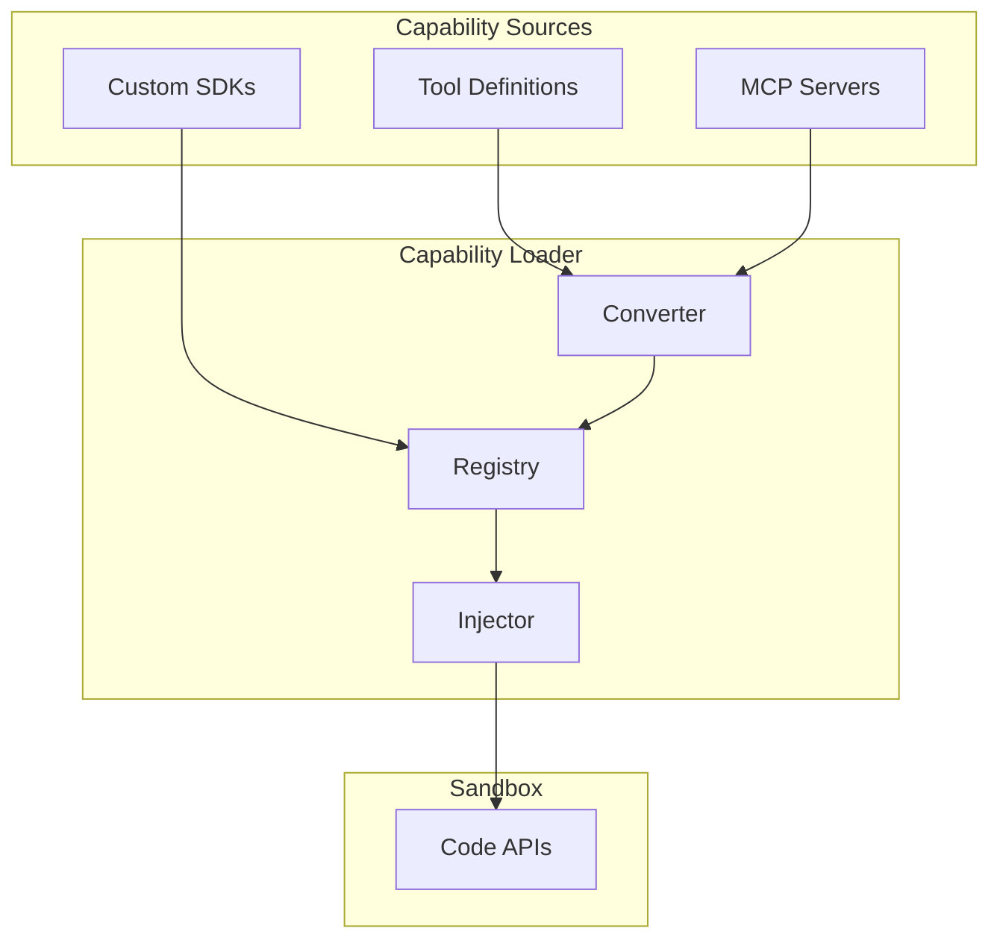
```mermaid
flowchart TB
    subgraph "Capability Sources"
        TOOLS[Tool Definitions]
        MCP[MCP Servers]
        SDK[Custom SDKs]
    end
    
    subgraph "Capability Loader"
        CONVERT[Converter]
        REGISTRY[Registry]
        INJECT[Injector]
    end
    
    subgraph "Sandbox"
        CODE_API[Code APIs]
    end
    
    TOOLS --> CONVERT
    MCP --> CONVERT
    SDK --> REGISTRY
    CONVERT --> REGISTRY
    REGISTRY --> INJECT
    INJECT --> CODE_API
```

### 9. Approval Service

Manages human-in-the-loop approval workflows:

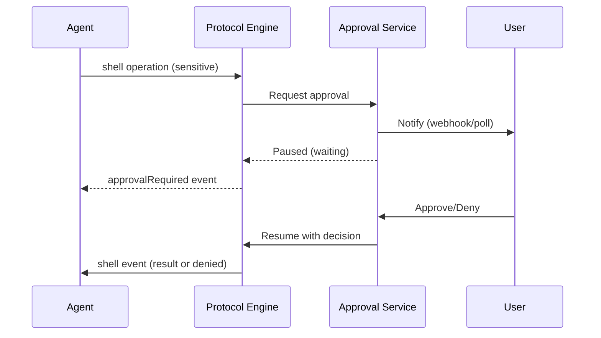
```mermaid
sequenceDiagram
    participant A as Agent
    participant P as Protocol Engine
    participant AS as Approval Service
    participant U as User
    
    A->>P: shell operation (sensitive)
    P->>AS: Request approval
    AS->>U: Notify (webhook/poll)
    AS-->>P: Paused (waiting)
    P-->>A: approvalRequired event
    
    U->>AS: Approve/Deny
    AS->>P: Resume with decision
    P->>A: shell event (result or denied)
```

### 10. Audit Logger

Records all operations and events for compliance and debugging:

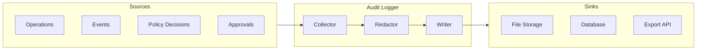
```mermaid
flowchart LR
    subgraph Sources
        OPS[Operations]
        EVENTS[Events]
        POLICY[Policy Decisions]
        APPROVALS[Approvals]
    end
    
    subgraph "Audit Logger"
        COLLECTOR[Collector]
        REDACTOR[Redactor]
        WRITER[Writer]
    end
    
    subgraph Sinks
        FILE[File Storage]
        DB[Database]
        EXPORT[Export API]
    end
    
    Sources --> COLLECTOR
    COLLECTOR --> REDACTOR
    REDACTOR --> WRITER
    WRITER --> Sinks
```

---

## Data Flow

### Run Execution Flow

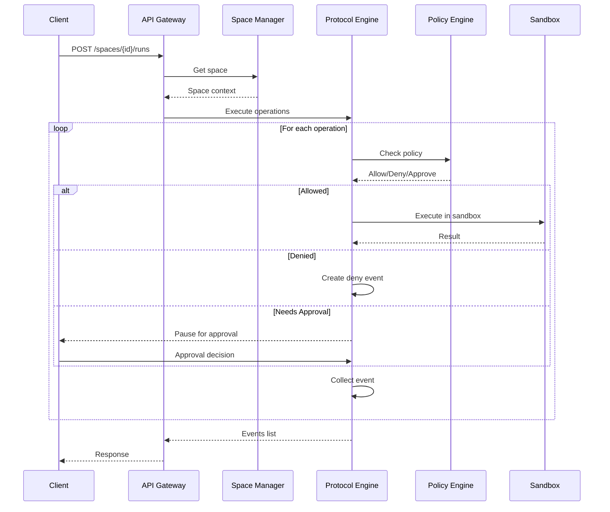
```mermaid
sequenceDiagram
    participant C as Client
    participant API as API Gateway
    participant SM as Space Manager
    participant PE as Protocol Engine
    participant POL as Policy Engine
    participant SB as Sandbox
    
    C->>API: POST /spaces/{id}/runs
    API->>SM: Get space
    SM-->>API: Space context
    API->>PE: Execute operations
    
    loop For each operation
        PE->>POL: Check policy
        POL-->>PE: Allow/Deny/Approve
        alt Allowed
            PE->>SB: Execute in sandbox
            SB-->>PE: Result
        else Denied
            PE->>PE: Create deny event
        else Needs Approval
            PE-->>C: Pause for approval
            C->>PE: Approval decision
        end
        PE->>PE: Collect event
    end
    
    PE-->>API: Events list
    API-->>C: Response
```

### File Operation Flow

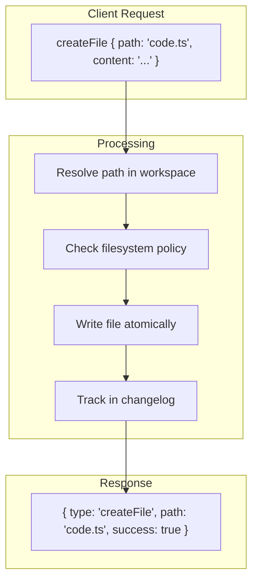
```mermaid
flowchart TB
    subgraph "Client Request"
        OP["createFile { path: 'code.ts', content: '...' }"]
    end
    
    subgraph "Processing"
        RESOLVE[Resolve path in workspace]
        CHECK[Check filesystem policy]
        WRITE[Write file atomically]
        TRACK[Track in changelog]
    end
    
    subgraph "Response"
        EVENT["{ type: 'createFile', path: 'code.ts', success: true }"]
    end
    
    OP --> RESOLVE --> CHECK --> WRITE --> TRACK --> EVENT
```

---

## Deployment Models

### Self-Hosted (Single Node)

For development and small deployments:

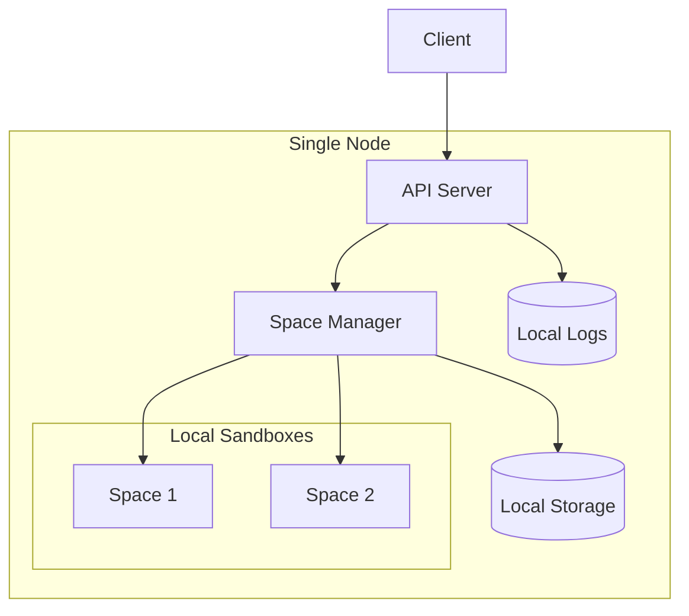
```mermaid
flowchart TB
    subgraph "Single Node"
        API[API Server]
        SM[Space Manager]
        
        subgraph "Local Sandboxes"
            S1[Space 1]
            S2[Space 2]
        end
        
        STORE[(Local Storage)]
        LOGS[(Local Logs)]
    end
    
    CLIENT[Client] --> API
    API --> SM
    SM --> S1
    SM --> S2
    SM --> STORE
    API --> LOGS
```

### Self-Hosted (Distributed)

For production deployments:

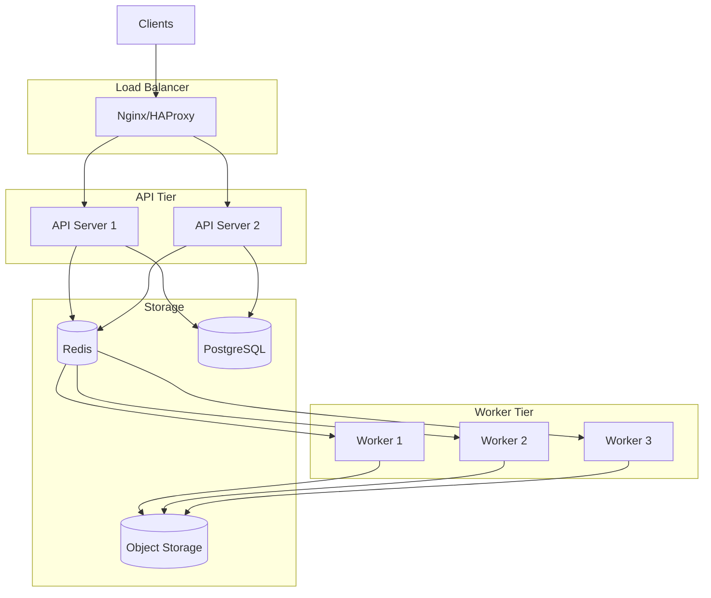
```mermaid
flowchart TB
    subgraph "Load Balancer"
        LB[Nginx/HAProxy]
    end
    
    subgraph "API Tier"
        API1[API Server 1]
        API2[API Server 2]
    end
    
    subgraph "Worker Tier"
        W1[Worker 1]
        W2[Worker 2]
        W3[Worker 3]
    end
    
    subgraph "Storage"
        REDIS[(Redis)]
        PG[(PostgreSQL)]
        S3[(Object Storage)]
    end
    
    CLIENT[Clients] --> LB
    LB --> API1
    LB --> API2
    
    API1 --> REDIS
    API2 --> REDIS
    
    REDIS --> W1
    REDIS --> W2
    REDIS --> W3
    
    W1 --> S3
    W2 --> S3
    W3 --> S3
    
    API1 --> PG
    API2 --> PG
```

### Hosted Service (Future)

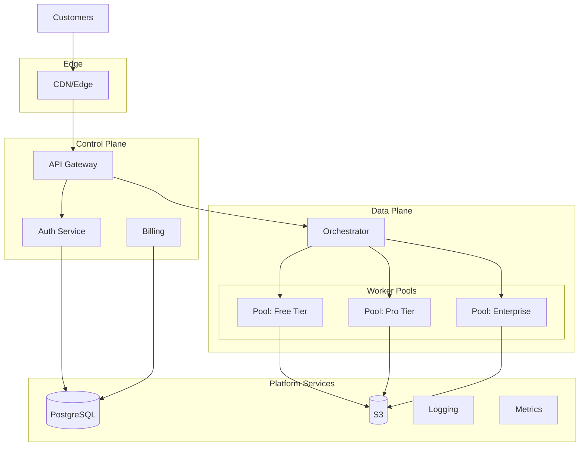
```mermaid
flowchart TB
    subgraph "Edge"
        CDN[CDN/Edge]
    end
    
    subgraph "Control Plane"
        API[API Gateway]
        AUTH[Auth Service]
        BILLING[Billing]
    end
    
    subgraph "Data Plane"
        ORCH[Orchestrator]
        
        subgraph "Worker Pools"
            WP1[Pool: Free Tier]
            WP2[Pool: Pro Tier]
            WP3[Pool: Enterprise]
        end
    end
    
    subgraph "Platform Services"
        PG[(PostgreSQL)]
        S3[(S3)]
        LOGS[Logging]
        METRICS[Metrics]
    end
    
    CUSTOMERS[Customers] --> CDN
    CDN --> API
    API --> AUTH
    API --> ORCH
    AUTH --> PG
    BILLING --> PG
    ORCH --> WP1
    ORCH --> WP2
    ORCH --> WP3
    WP1 --> S3
    WP2 --> S3
    WP3 --> S3
```

---

## Security Architecture

### Defense in Depth

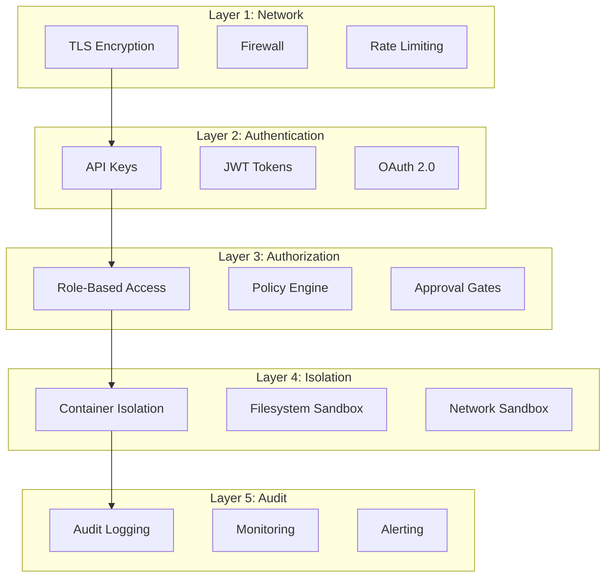
```mermaid
flowchart TB
    subgraph "Layer 1: Network"
        TLS[TLS Encryption]
        FW[Firewall]
        RATE[Rate Limiting]
    end
    
    subgraph "Layer 2: Authentication"
        API_KEY[API Keys]
        JWT[JWT Tokens]
        OAUTH[OAuth 2.0]
    end
    
    subgraph "Layer 3: Authorization"
        RBAC[Role-Based Access]
        POLICY[Policy Engine]
        APPROVAL[Approval Gates]
    end
    
    subgraph "Layer 4: Isolation"
        CONTAINER[Container Isolation]
        FS_SANDBOX[Filesystem Sandbox]
        NET_SANDBOX[Network Sandbox]
    end
    
    subgraph "Layer 5: Audit"
        LOGGING[Audit Logging]
        MONITOR[Monitoring]
        ALERTS[Alerting]
    end
    
    TLS --> API_KEY
    API_KEY --> RBAC
    RBAC --> CONTAINER
    CONTAINER --> LOGGING
```

### Secret Management

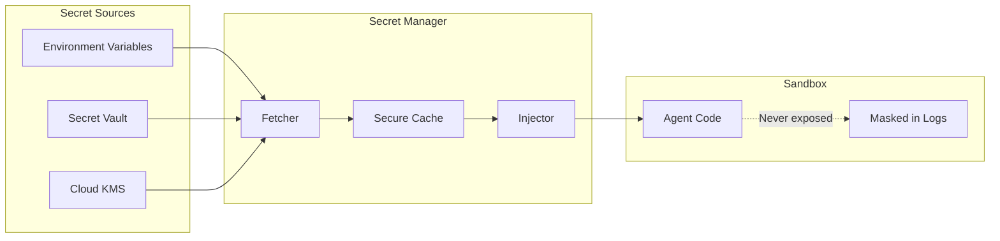
```mermaid
flowchart LR
    subgraph "Secret Sources"
        ENV[Environment Variables]
        VAULT[Secret Vault]
        KMS[Cloud KMS]
    end
    
    subgraph "Secret Manager"
        FETCH[Fetcher]
        CACHE[Secure Cache]
        INJECT[Injector]
    end
    
    subgraph "Sandbox"
        CODE[Agent Code]
        MASKED[Masked in Logs]
    end
    
    ENV --> FETCH
    VAULT --> FETCH
    KMS --> FETCH
    
    FETCH --> CACHE
    CACHE --> INJECT
    INJECT --> CODE
    
    CODE -.->|Never exposed| MASKED
```

---

## Component Interaction Summary

| Component | Interacts With | Purpose |
|-----------|---------------|---------|
| API Gateway | All services | Request routing, auth, validation |
| Space Manager | Sandbox Engine, Storage | Space lifecycle management |
| Protocol Engine | Policy, FS, Shell Engines | Operation execution |
| Policy Engine | All execution paths | Security enforcement |
| Sandbox Engine | Container Runtime | Isolation management |
| Filesystem Engine | Storage Backend | File operations |
| Shell Engine | Sandbox Processes | Command execution |
| Capability Loader | Sandbox Engine | SDK injection |
| Approval Service | Protocol Engine, Users | Human approval workflows |
| Audit Logger | All components | Compliance and debugging |

---

## Next Steps

See related design documents:
- [Technology Choices](./technology-choices.md) for implementation decisions
- [Protocol Spec](./protocol-spec.md) for detailed protocol definition
- [REST API Spec](./rest-api-spec.md) for API contracts

